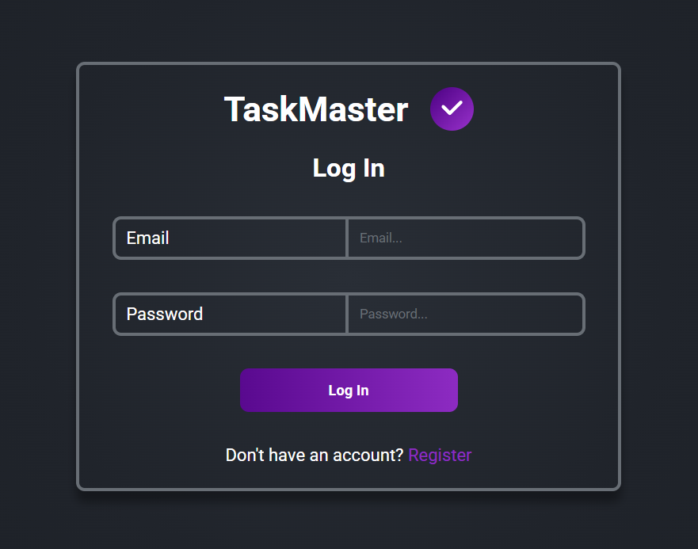
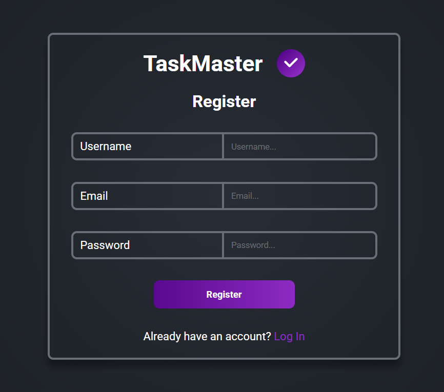
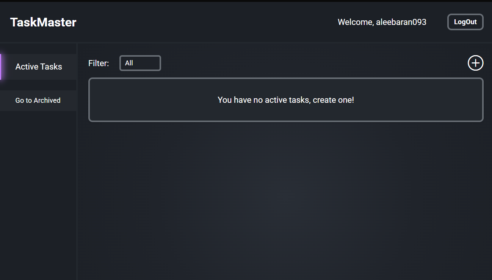
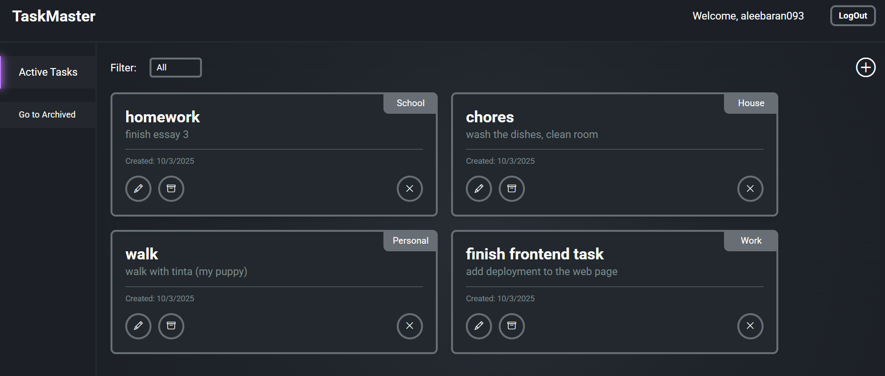
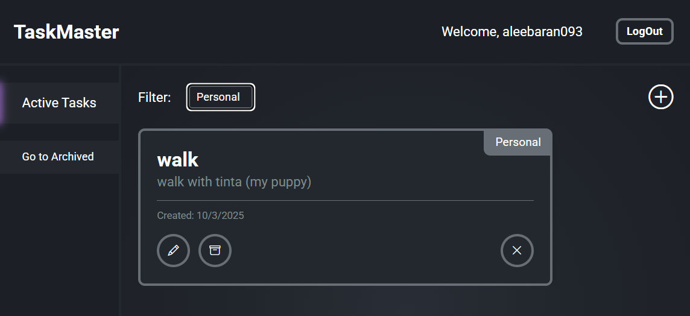
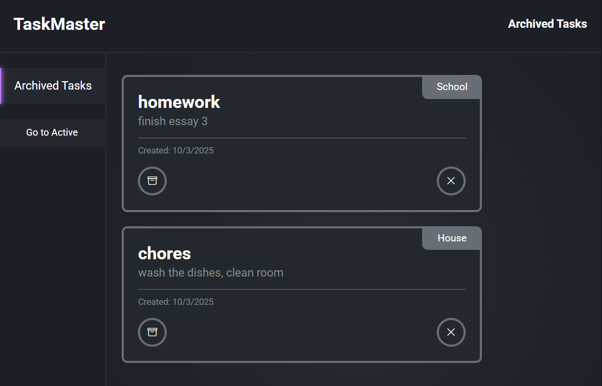
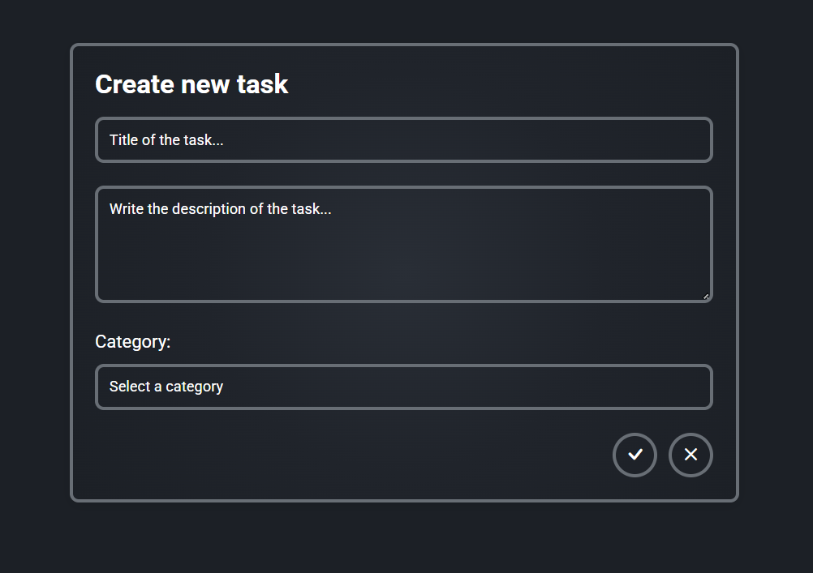

##TaskMaster
TaskMaster is a full-stack task management application developed as part of a technical test.
The app allows users to create, edit, delete, archive, and filter tasks, with user authentication (login & register).

<---------------------------------------------------------------------->

🚀 Features
-User authentication: Register & Login.
-CRUD operations for tasks: create, edit, delete.
-Archive/unarchive tasks.
-Filtering system to organize tasks.
-Clean and minimal React frontend.
-MongoDB + Express + Node.js backend.

<---------------------------------------------------------------------->

🛠️ Tech Stack
-Frontend: React, CSS
-Backend: Node.js, Express
-Database: MongoDB
-Shell / DevOps: Bash script (start.sh)

Others:
-CORS
-JSON Web Tokens (JWT)
-Middlewares, routing, etc.

<---------------------------------------------------------------------->

📂 Project Structure
/frontend   → React app
/backend    → Express + MongoDB API

<---------------------------------------------------------------------->

⚙️ Installation & Setup
Prerequisites
-Node.js >= 18
-MongoDB instance (local or cloud, e.g. MongoDB Atlas)

Clone the repository
-git clone https://github.com/hirelens-challenges/Baran-078b5c
-cd Baran-078b5c

Start the project
chmod +x start.sh
./start.sh

This script will start both frontend and backend services.

<---------------------------------------------------------------------->

Environment Variables
For the backend, configure:
-MONGO_URI
-JWT_SECRET
-PORT (optional)

For the frontend:
-REACT_APP_API_URL pointing to your backend

<---------------------------------------------------------------------->

💻 Usage
-Register a new account or log in with an existing one.
-Create, edit, delete, or archive tasks.
-Use filters to manage your workflow.

<---------------------------------------------------------------------->

📸 Screenshots

📌 Notes

-The original assignment requested the use of an ORM.
-Due to time constraints (3 days) and my current student level, I decided to implement the backend with MongoDB instead of learning a new ORM on the spot.
-My priority was delivering a complete and functional solution, even if it didn’t strictly follow the ORM requirement.
-I couldnt deploy web page in time